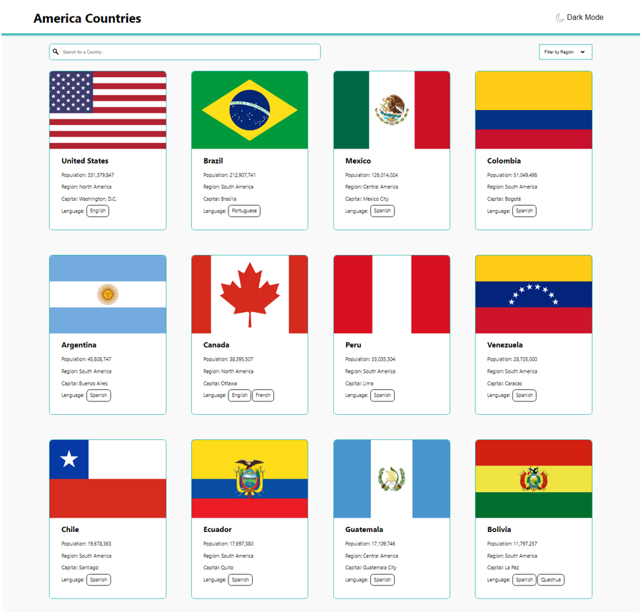

# America Countries

### This project was made to practice Express and React with typescript, styled components, react-query and deploy apis in Heroku

## Figma Draft

https://www.figma.com/file/NF2ahf5GTluFRYPouTRKCY/america-countries?node-id=0%3A1

## Page deployed with Heroku

https://america-countries-app.herokuapp.com/

## If you want to use this api

https://america-countries-app.herokuapp.com/api

### How to Start

i use npm workspaces to make a monorepo, if you want to run this code you need to have npm version 7 or above

- npm install
- npm run build
- npm run dev
